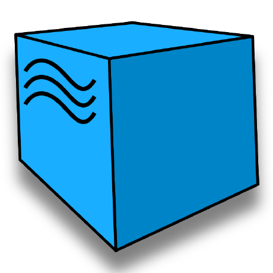
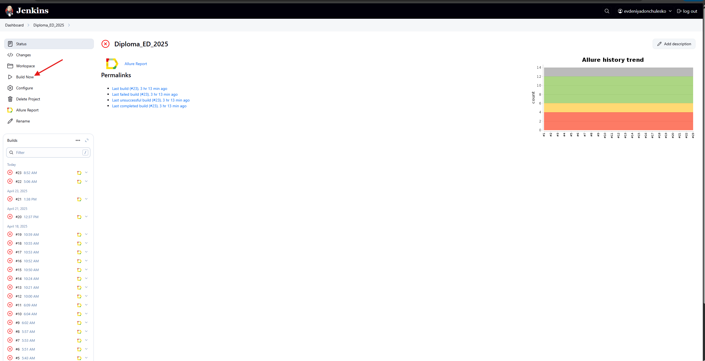
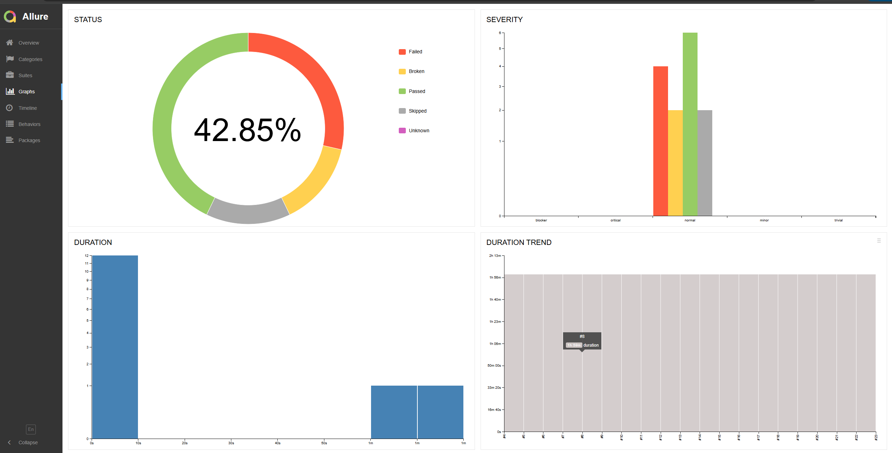

##  Дипломный проект UI+APIMore 

- [Ссылка на занятие](https://school.qa.guru/pl/teach/control/lesson/view?id=334954986&editMode=0) 
- [Инструкция по проверке диплома](https://rainbow-spleen-3c9.notion.site/QA-GURU-PYTHON-ff276648b76a4e6b8bb538051ddf6fb4)


# Проект тестирования "demoqa.com" UI+API 


## 🌐 DemoQA — учебный веб-сайт для практики тестирования


**[DemoQA](https://demoqa.com)** — это учебный веб-сайт, предназначенный для практики тестирования веб-приложений.  
Он предоставляет различные интерактивные элементы и сценарии, такие как:

- формы,
- кнопки,
- таблицы,
- всплывающие окна,
- фреймы,
- демо-приложение книжного магазина.

Это идеальная платформа для тренировки навыков UI- и API-тестирования.


## Проект реализован с использованием 
<p align="left">
   
  
  
  
  
  
  
  
  
</p>

## Список проверок, реализованных в автотестах
### UI
- [x] Лендинг. Переход на https://demoqa.com/automation-practice-form
- [x] Авторизация. Успешная авторизация 

### API

- [x] Проверка успешной авторизации - POST  https://demoqa.com/Account/v1/Login   Ожидаемый статус-код: 200 OK
- [x] Проверка неуспешной авторизации (неверный пароль) POST https://demoqa.com/Account/v1/Login  Ожидаемый статус-код: 401 User not found!


## Установка
```sh
pip install -r requirements.txt  # Установка зависимостей

```

## Запуск тестов

```
--alluredir=./allure-results - #run configuration, additional arguments (указать для каждого файла и директории с тестами 
для формирования аллюр отчета)
```

```sh
pytest tests/ # Запуск всех тестов в проекте
```

```sh
pytest -v tests/  # Запуск всех тестов с детальным логом
```

```sh
pytest --alluredir=allure-results  # Запуск с сохранением отчёта Allure
```


##  Запуск проекта в Jenkins
[Job](https://jenkins.autotests.cloud/job/Diploma_ED_2025/)

При нажатии на  "Build Now" начнется сборка тестов и их прохождение через виртуальную машину в Selenide.


##  Allure report
После прохождения тестов, результаты можно посмотреть в Allure отчете, где также содержится ссылка на Jenkins.


Во вкладке Graphs можно посмотреть графики о прохождении тестов, по их приоритизации, по времени прохождения и др.


Во вкладке Suites находятся собранные тест-кейсы, у которых описаны шаги и приложены логи, скриншот и видео о прохождении теста.


Видео прохождения теста:


##  Интеграция с Telegram
После прохождения тестов, в Telegram bot приходит сообщение с графиком и небольшой информацией о тестовом прогоне.

